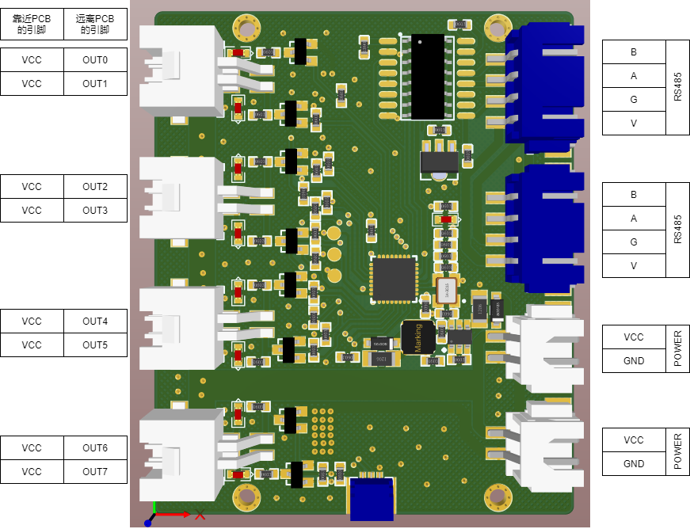
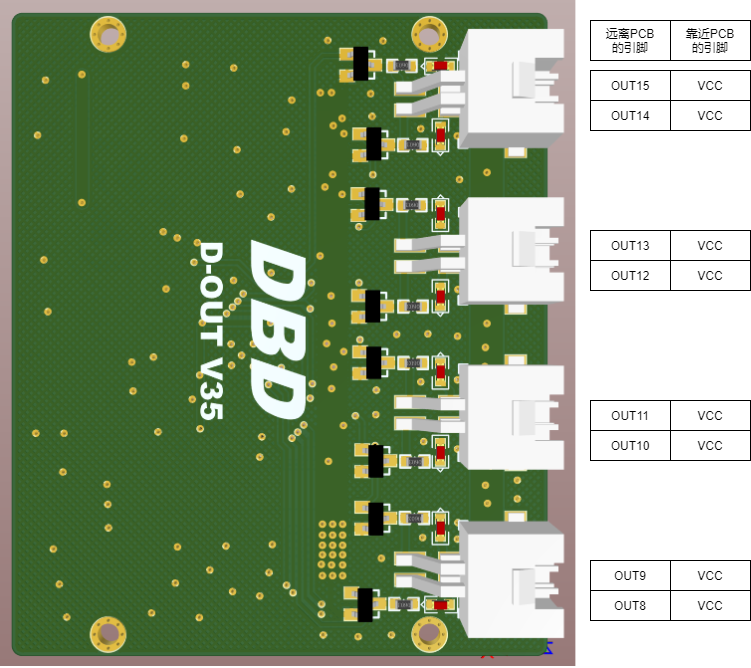

# BeeOut

> 16路IO输出模块 - 高性能工业级数字输出控制器

[](LICENSE)
[](#)

## 📋 目录

- [产品概述](#产品概述)
- [技术规格](#技术规格)
- [接口定义](#接口定义)
- [通信协议](#通信协议)
- [使用说明](#使用说明)
- [注意事项](#注意事项)

## 🔍 产品概述

BeeOut是一款专业的16路IO输出模块，适用于工业自动化、机器人控制、智能家居等场景。支持RS485通信，可控制继电器、电磁刹车等设备。

### 主要特性

- ✅ 16路独立数字输出通道
- ✅ 支持12V/24V工作电压
- ✅ RS485通信接口，支持高速数据传输
- ✅ 工业级设计，稳定可靠
- ✅ 简单易用的通信协议

## ⚡ 技术规格

| 参数 | 规格 | 备注 |
|------|------|------|
| **输出通道** | 16路独立IO输出 | 数字输出 |
| **工作电压** | 12V/24V | 宽电压范围 |
| **输出电流** | 500mA/通道 | 单通道最大电流 |
| **通信接口** | RS485 | 工业标准接口 |
| **波特率** | 250Kbps (RS485)<br>2Mbps (USB485) | 高速通信 |
| **工作温度** | -20°C ~ +70°C | 工业级温度范围 |
| **防护等级** | IP20 | 适合室内使用 |

## 🔌 接口定义

### 引脚布局

#### A面引脚定义
<div align="center">
  
  <p><em>A面引脚布局图</em></p>
</div>

#### B面引脚定义
<div align="center">
  
  <p><em>B面引脚布局图</em></p>
</div>

## 📡 通信协议

### 通信参数

| 参数 | 值 | 说明 |
|------|----|----- |
| **RS485波特率** | 250Kbps | 标准通信速率 |
| **USB485波特率** | 2Mbps | 高速通信速率 |
| **数据位** | 8 | 数据位长度 |
| **停止位** | 1 | 停止位数量 |
| **校验位** | 0 (无校验) | 校验方式 |
| **通讯帧长度** | 8字节 | 固定帧长 |
| **通讯模式** | 一发一收 | 请求-响应模式 |

### 通讯帧格式

| 字节位置 | 长度 | 字段名称 | 说明 |
|----------|------|----------|------|
| 0 | 1字节 | 功能码 | 操作类型标识 |
| 1 | 1字节 | 参数索引 | 参数类型索引 |
| 2 | 1字节 | ID | 设备ID |
| 3 | 1字节 | 子ID | 子设备ID |
| 4-7 | 4字节 | 数据值 | 32位整数数据 |

### 功能码定义

| 功能码 | 名称 | 说明 |
|--------|------|------|
| `0x00` | 读参数 | 读取设备参数 |
| `0x01` | 写参数 | 写入设备参数 |
| `0x02` | 读成功 | 读取操作成功响应 |
| `0x03` | 写成功 | 写入操作成功响应 |
| `0x04` | 参数保存 | 保存参数到FLASH |

### 参数索引列表

| 参数名称 | 索引值 | 说明 |
|----------|--------|------|
| **IO输出** | 23 | 控制16路IO输出状态 |

### 参数保存指令

> ⚠️ **重要提示**: 不要频繁写入FLASH，其寿命约为10,000次写入周期

| 字段 | 值 | 说明 |
|------|----|----- |
| 功能码 | `0x04` | 参数保存指令 |
| 参数索引 | `0x01` | 固定值 |
| ID | `0xXX` | 目标设备ID |
| 子ID | `0x00` | 固定值 |
| 数据值 | `0x01 0x00 0x00 0x00` | 保存指令数据 |

## 🚀 使用说明

### IO输出控制

数据值使用32位整数的低16位来控制对应的输出通道（0-15）。

#### 通道映射

| 通道 | 位操作 | 十六进制值 | 说明 |
|------|--------|------------|------|
| 通道0 | `0x01 << 0` | `0x0001` | 控制第1路输出 |
| 通道1 | `0x01 << 1` | `0x0002` | 控制第2路输出 |
| 通道2 | `0x01 << 2` | `0x0004` | 控制第3路输出 |
| ... | ... | ... | ... |
| 通道14 | `0x01 << 14` | `0x4000` | 控制第15路输出 |
| 通道15 | `0x01 << 15` | `0x8000` | 控制第16路输出 |

#### 示例代码

```c
// 控制通道0和通道1同时输出
uint32_t output_value = (0x01 << 0) | (0x01 << 1);  // 0x0003

// 控制所有通道输出
uint32_t all_on = 0xFFFF;  // 所有16个通道

// 关闭所有通道
uint32_t all_off = 0x0000;
```

## ⚠️ 注意事项

1. **电源要求**: 确保供电电压稳定，建议使用12V或24V开关电源
2. **电流限制**: 单通道最大输出电流500mA，请勿超载使用
3. **FLASH寿命**: 参数保存功能会写入FLASH，请避免频繁调用
4. **通信距离**: RS485通信距离可达1200米（使用双绞线）
5. **接地保护**: 建议系统接地以提高抗干扰能力

## 📄 许可证

本项目采用 MIT 许可证 - 查看 [LICENSE](LICENSE) 文件了解详情。

---

<div align="center">
  <p>🐝 <strong>BeeOut</strong> - 让IO控制更简单</p>
</div>